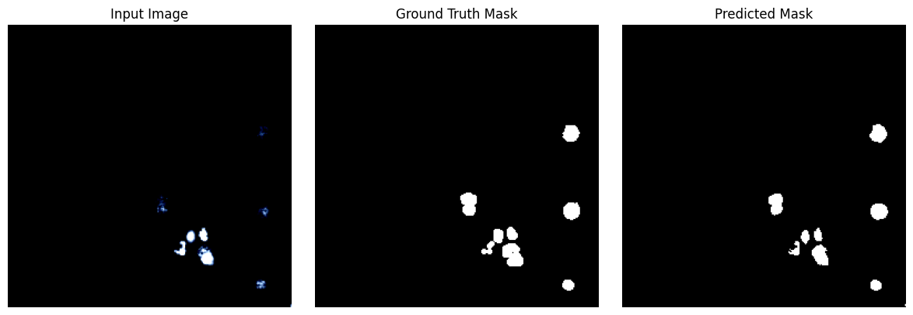

# 🧬 U-Net for Biological Image Segmentation

This project implements a U-Net architecture to perform semantic segmentation of nuclei in fluorescence microscopy images. The model was trained and evaluated on a biomedical dataset with strong performance in overlap-based metrics like Dice and IoU.

---

## 📂 Dataset

- Source: [Kaggle - Nuclei Image Segmentation (Espsiyam)](https://www.kaggle.com/datasets/espsiyam/nuclei-image-segmentation)
- Format:
  - Input images: RGB fluorescence microscopy
  - Masks: Instance-level binary masks (merged into single binary mask)

---

## 🚀 Project Highlights

| Metric | Value |
|--------|-------|
| **Dice Coefficient** | `0.8946` |
| **IoU**             | `0.8192` |
| **Final Loss**      | `0.0653` |

> ⚙️ Trained for 100 epochs using PyTorch with CLAHE and Gaussian Blur preprocessing.

---

## 🏗️ U-Net Architecture

- Custom lightweight U-Net in PyTorch
- Input: 3-channel RGB (256×256)
- Output: Single-channel mask (sigmoid)
- Loss: Binary Cross Entropy
- Optimizer: Adam (`lr = 1e-3`)

---

## 📊 Visualization

| Input Image | Ground Truth | Predicted Mask |
|-------------|--------------|----------------|
| |

---

## 🧪 Preprocessing

- ✔️ CLAHE (adaptive histogram equalization)
- ✔️ Gaussian blur for denoising
- ✔️ Normalization and resizing (256×256)

---

## 🧠 What I Learned

- Biomedical image preprocessing techniques
- Implementing U-Net from scratch in PyTorch
- Metric-based evaluation for segmentation (Dice, IoU)
- Dataset parsing from mask instances to single masks
- Efficient model training and visualization in Colab

---

## 📁 Project Structure

